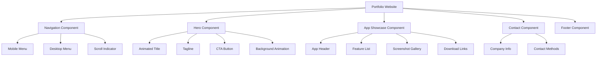

# Design Document: Qaf Studio Portfolio Website

## Overview

The Qaf Studio portfolio website is a modern, animated single-page application (SPA) that showcases the company's mobile app development expertise. The website features a dark theme with vibrant accents, smooth scroll-based animations, and responsive layouts optimized for all device sizes.

The architecture follows a component-based approach with modular sections that can be independently animated and styled. The design prioritizes performance through lazy loading, code splitting, and optimized asset delivery while maintaining rich visual effects.

**Key Design Principles:**
- Mobile-first responsive design
- Progressive enhancement for animations
- Performance-optimized asset delivery
- Accessibility-conscious implementation
- Modular, maintainable component structure

## Architecture

### High-Level Structure

The website follows a single-page application architecture with distinct sections:

```
Portfolio Website
├── Header/Navigation
├── Hero Section
├── What to Watch AI Showcase
├── GamePicker AI Showcase
├── Contact/About Section
└── Footer
```

### Technology Stack

**Core Technologies:**
- HTML5 for semantic markup
- CSS3 with CSS Grid and Flexbox for layouts
- Vanilla JavaScript (ES6+) for interactivity
- CSS Custom Properties for theming

**Animation Libraries:**
- GSAP (GreenSock Animation Platform) for complex animations and scroll triggers
- Intersection Observer API for scroll-based animation triggers
- CSS transitions for simple hover effects

**Styling Approach:**
- Custom CSS with BEM methodology for naming conventions
- CSS Grid for complex layouts
- Flexbox for component-level layouts
- CSS Custom Properties for theme management

**Performance Tools:**
- Native lazy loading for images
- Intersection Observer for viewport detection
- CSS containment for layout optimization
- Will-change property for animation optimization

### Component Architecture



## Components and Interfaces

### 1. Navigation Component

**Purpose:** Provides site-wide navigation with smooth scrolling and active section highlighting.

**Structure:**
```javascript
NavigationComponent {
  elements: {
    nav: HTMLElement,
    menuToggle: HTMLElement,
    menuItems: HTMLElement[]
  },
  
  state: {
    isOpen: boolean,
    activeSection: string,
    isSticky: boolean
  },
  
  methods: {
    init(): void
    toggleMenu(): void
    scrollToSection(sectionId: string): void
    updateActiveLink(sectionId: string): void
    handleScroll(): void
  }
}
```

**Behavior:**
- On desktop (>768px): Horizontal menu bar with smooth hover effects
- On mobile (<768px): Hamburger menu with slide-in animation
- Sticky positioning activates after scrolling past hero section
- Active link highlighting based on scroll position using Intersection Observer
- Smooth scroll to sections with easing function

**Responsive Breakpoints:**
- Mobile: 0-767px (stacked menu, hamburger icon)
- Tablet: 768-1023px (horizontal menu, compact spacing)
- Desktop: 1024px+ (horizontal menu, full spacing)

### 2. Hero Component

**Purpose:** Creates an impactful first impression with animated branding and call-to-action.

**Structure:**
```javascript
HeroComponent {
  elements: {
    container: HTMLElement,
    title: HTMLElement,
    subtitle: HTMLElement,
    ctaButton: HTMLElement,
    backgroundElements: HTMLElement[]
  },
  
  animations: {
    titleAnimation: GSAPTimeline,
    backgroundParallax: GSAPTimeline
  },
  
  methods: {
    init(): void
    playEntranceAnimation(): void
    setupParallax(): void
  }
}
```

**Animation Sequence:**
1. Background elements fade in (0-0.5s)
2. Title animates in with scale and fade (0.3-0.8s)
3. Subtitle slides up with fade (0.6-1.1s)
4. CTA button bounces in (0.9-1.4s)
5. Parallax effect activates on scroll

**Content:**
- Company name: "Qaf Studio"
- Tagline: "Crafting Exceptional Mobile Experiences"
- CTA: "Explore Our Apps" (scrolls to first app showcase)
- Animated background: Gradient mesh or geometric shapes

### 3. App Showcase Component

**Purpose:** Displays detailed information about each mobile app with features, screenshots, and download links.

**Structure:**
```javascript
AppShowcaseComponent {
  data: {
    appName: string,
    tagline: string,
    description: string,
    features: string[],
    screenshots: string[],
    links: {
      ios: string,
      android: string,
      web: string
    },
    highlights: string[]
  },
  
  elements: {
    container: HTMLElement,
    header: HTMLElement,
    featureList: HTMLElement,
    gallery: HTMLElement,
    downloadSection: HTMLElement
  },
  
  methods: {
    init(): void
    renderFeatures(): void
    initGallery(): void
    setupScrollAnimations(): void
  }
}
```

**Layout Variations:**
- Alternating left/right layouts for visual interest
- What to Watch AI: Image on left, content on right
- GamePicker AI: Content on left, image on right

**Screenshot Gallery:**
- Desktop: 3-column grid with hover zoom effect
- Tablet: 2-column grid
- Mobile: Single column with horizontal scroll
- Click to view full-size modal (optional enhancement)

**Feature Presentation:**
- Icon + text format for each feature
- Staggered entrance animation on scroll
- Hover effects for interactivity

**Download Links:**
- Platform-specific buttons with icons
- iOS: Apple App Store badge
- Android: Google Play badge
- Web: Custom "Try Web App" button
- All links open in new tab with rel="noopener noreferrer"

### 4. Contact Component

**Purpose:** Provides company information and contact methods.

**Structure:**
```javascript
ContactComponent {
  data: {
    companyName: string,
    description: string,
    email: string,
    socialLinks: {
      platform: string,
      url: string
    }[]
  },
  
  elements: {
    container: HTMLElement,
    infoSection: HTMLElement,
    contactMethods: HTMLElement
  },
  
  methods: {
    init(): void
    setupAnimations(): void
  }
}
```

**Content:**
- Company name and description
- Focus area: "Specializing in Android & iOS App Development"
- Contact email or form
- Social media links (if applicable)
- Animated entrance on scroll

### 5. Animation System

**Purpose:** Manages all animations across the website with performance optimization.

**Structure:**
```javascript
AnimationSystem {
  config: {
    reducedMotion: boolean,
    scrollTriggerDefaults: object,
    easingFunctions: object
  },
  
  observers: {
    intersectionObserver: IntersectionObserver,
    scrollObserver: ScrollObserver
  },
  
  methods: {
    init(): void
    registerScrollAnimation(element: HTMLElement, config: object): void
    createTimeline(config: object): GSAPTimeline
    checkReducedMotion(): boolean
    optimizePerformance(): void
  }
}
```

**Animation Types:**

1. **Scroll Animations:**
   - Fade in + slide up for section entrances
   - Stagger animations for lists and grids
   - Parallax for background elements
   - Trigger point: 20% of element visible in viewport

2. **Hover Animations:**
   - Scale + shadow for buttons (1.05x scale, 0.3s duration)
   - Color transitions for links (0.2s duration)
   - Image zoom for screenshots (1.1x scale, 0.4s duration)

3. **Parallax Effects:**
   - Background elements move at 0.5x scroll speed
   - Applied to hero background and section dividers
   - Disabled on mobile for performance

**Performance Optimizations:**
- Use `will-change` property for animated elements
- Debounce scroll event listeners
- Use `requestAnimationFrame` for smooth updates
- Respect `prefers-reduced-motion` media query
- Lazy load GSAP library after initial render

## Data Models

### App Data Model

```javascript
App {
  id: string,
  name: string,
  tagline: string,
  description: string,
  features: Feature[],
  screenshots: Screenshot[],
  links: AppLinks,
  highlights: string[],
  reviews: Review[]
}

Feature {
  icon: string,
  title: string,
  description: string
}

Screenshot {
  url: string,
  alt: string,
  thumbnail: string
}

AppLinks {
  ios: string,
  android: string,
  web: string
}

Review {
  rating: number,
  text: string,
  highlight: boolean
}
```

**What to Watch AI Data:**
```javascript
{
  id: "what-to-watch-ai",
  name: "What to Watch AI",
  tagline: "Cinematic Intelligence",
  description: "AI-powered movie & TV recommendation app that helps you discover your next favorite show",
  features: [
    { icon: "search", title: "Deep Search", description: "Advanced AI-powered content discovery" },
    { icon: "heart", title: "Couple Match", description: "Find shows you both will love" },
    { icon: "quiz", title: "Daily Quizzes", description: "Fun challenges to discover new content" },
    { icon: "brain", title: "Smart Recommendations", description: "Personalized suggestions based on your taste" }
  ],
  screenshots: [
    { url: "/images/wtw-1.png", alt: "What to Watch AI Home Screen", thumbnail: "/images/wtw-1-thumb.png" },
    { url: "/images/wtw-2.png", alt: "Deep Search Feature", thumbnail: "/images/wtw-2-thumb.png" },
    { url: "/images/wtw-3.png", alt: "Couple Match", thumbnail: "/images/wtw-3-thumb.png" }
  ],
  links: {
    ios: "https://apps.apple.com/tr/app/what-to-watch-ai-movies-tv/id6756384424",
    android: "https://play.google.com/store/apps/details?id=com.cine.ai",
    web: "https://whattowatch-ai.netlify.app/"
  },
  highlights: ["5-star ratings", "Deep Search", "Couple Match"],
  reviews: []
}
```

**GamePicker AI Data:**
```javascript
{
  id: "gamepicker-ai",
  name: "GamePicker AI",
  tagline: "Next Gen Game Discovery",
  description: "AI-powered game discovery with real-time chat, instant deals, and smart recommendations",
  features: [
    { icon: "users", title: "Game Buddy", description: "Lobbies & real-time chat with gamers" },
    { icon: "user-plus", title: "Add Friends", description: "Connect with fellow gamers" },
    { icon: "message", title: "Private Chat", description: "Direct messaging with friends" },
    { icon: "brain", title: "Advanced AI Brain", description: "Powered by Groq LPU™ technology" },
    { icon: "tag", title: "Instant Deal Finder", description: "Best prices from Steam, Epic, GOG" },
    { icon: "filter", title: "Precision Filters", description: "Find exactly what you're looking for" }
  ],
  screenshots: [
    { url: "/images/gp-1.png", alt: "GamePicker AI Home", thumbnail: "/images/gp-1-thumb.png" },
    { url: "/images/gp-2.png", alt: "Game Buddy Feature", thumbnail: "/images/gp-2-thumb.png" },
    { url: "/images/gp-3.png", alt: "Deal Finder", thumbnail: "/images/gp-3-thumb.png" }
  ],
  links: {
    ios: "https://apps.apple.com/tr/app/gamepicker-ai-games-deals/id6757809432?l=tr",
    android: "https://play.google.com/store/apps/details?id=com.gamepicker.gamepicker_ai",
    web: "https://gamepickerai.netlify.app/"
  },
  highlights: ["Groq LPU™", "Game Buddy", "Instant Deals"],
  reviews: []
}
```

### Theme Configuration

```javascript
ThemeConfig {
  colors: {
    primary: string,      // Main brand color
    secondary: string,    // Accent color
    background: string,   // Dark background
    surface: string,      // Card/section background
    text: {
      primary: string,    // Main text color
      secondary: string,  // Muted text color
      accent: string      // Highlighted text
    }
  },
  
  spacing: {
    xs: string,  // 0.5rem
    sm: string,  // 1rem
    md: string,  // 2rem
    lg: string,  // 4rem
    xl: string   // 6rem
  },
  
  typography: {
    fontFamily: {
      heading: string,
      body: string
    },
    fontSize: {
      xs: string,
      sm: string,
      base: string,
      lg: string,
      xl: string,
      xxl: string,
      xxxl: string
    }
  },
  
  breakpoints: {
    mobile: string,   // 768px
    tablet: string,   // 1024px
    desktop: string   // 1280px
  }
}
```

**Recommended Color Palette:**
```css
:root {
  /* Dark theme base */
  --color-background: #0a0a0f;
  --color-surface: #1a1a2e;
  
  /* Vibrant accents */
  --color-primary: #6366f1;      /* Indigo */
  --color-secondary: #ec4899;    /* Pink */
  --color-accent: #14b8a6;       /* Teal */
  
  /* Text colors */
  --color-text-primary: #f8fafc;
  --color-text-secondary: #94a3b8;
  --color-text-accent: #fbbf24;
  
  /* Gradients */
  --gradient-primary: linear-gradient(135deg, #6366f1 0%, #ec4899 100%);
  --gradient-secondary: linear-gradient(135deg, #14b8a6 0%, #6366f1 100%);
}
```

## Correctness Properties

*A property is a characteristic or behavior that should hold true across all valid executions of a system—essentially, a formal statement about what the system should do. Properties serve as the bridge between human-readable specifications and machine-verifiable correctness guarantees.*

